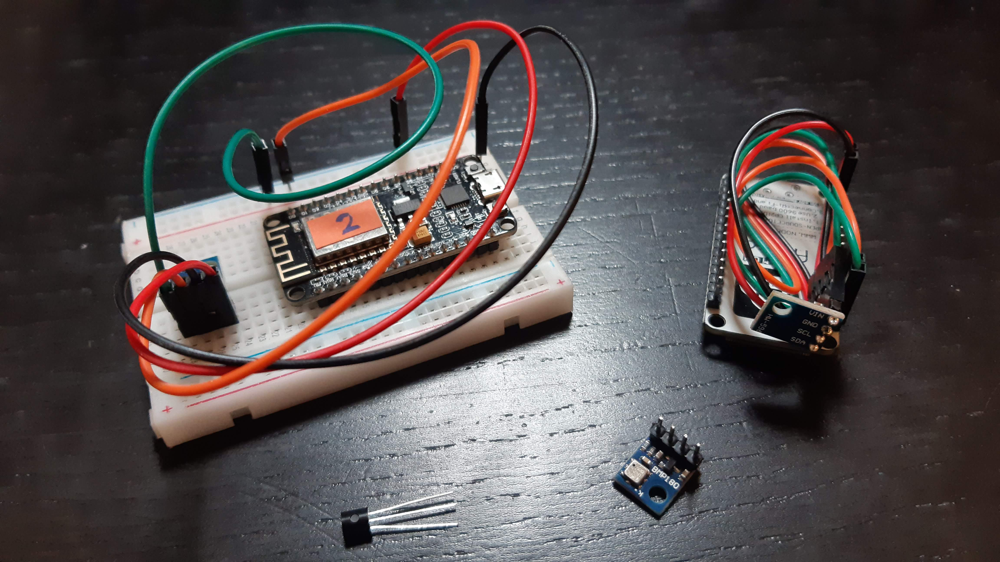

# Sentinel

Home monitoring system running on a NodeMCU ESP8266 ESP-12F.

The idea behind this project is to have a base system working on a standard
microcontroller with communication capabilities, http/https, mqtt...

See the [Nidus](https://github.com/alexandrelamberty/nidus/) repository and the
[Sentinel Api Spec](https://github.com/alexandrelamberty/sentinel-api)

## Features

- [ ] Configuration
  - [x] Wifi 
      - [x] Access Point 
      - [x] Configuration
  - [x] Auto-pairing
  - [ ] Auto updates
- [ ] Protocols
  - [x] HTTP
  - [ ] HTTPS
  - [ ] MQTT
- [ ] Sensors
  - [x] BMP180
  - [ ] DS18B20
- [ ] Security
  - [x] Configuration AP
  - [ ] Key
- [ ] Tests

## Technolgies

- [Arduino](https://www.arduino.cc/)

## Hardware

The hardware I currently use is a 
[NodeMCU Lua Amica Module V2 ESP8266 ESP-12FCP2102]() 
micro-controller, a temperature sensor [DS18B20]() and temperature and
pressure sensor [BMP180]().



## Installation

### Arduino 

Open the Arduino Preferences <kbd>Ctrl</kbd>+<kbd>,</kbd> and in `Additional
Boards Manager Urls`
add the following one:
```
https://arduino.esp8266.com/stable/package_esp8266com_index.json
```

Open the Arduino Library Manager <kbd>Ctrl</kbd>+<kbd>Shift</kbd>+<kbd>I</kbd>
and install the following packages:

- ArduinoJson
- ArduinoMqttClient
- [BMP180_Breakout_Arduino_Library](https://github.com/sparkfun/BMP180_Breakout_Arduino_Library)
- WiFiManager

Upload the sketch

## Configuration

Connect the device to a power supply.

Connect your phone to the new access point created by the device. It should be
something like `sentinel-xxx`.

Then access the device settings by navigating to http://192.168.4.1 and complete
the setup.

The device then will restart and will pair automatically with the server.

